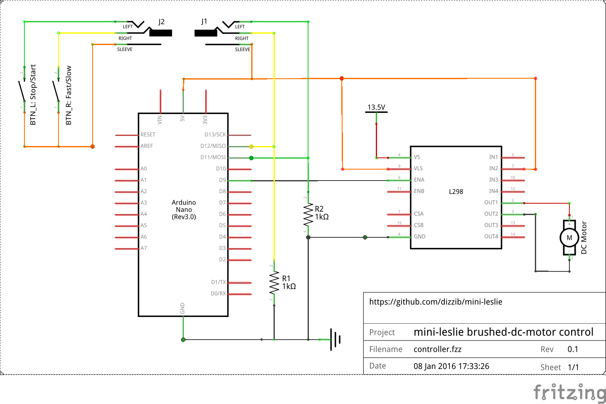

# Brushed DC motor controller

## Parts

* Arduino Nano (or similar)
* L298N motor driver board
* 24v/120w scooter DC motor (not recommended -- see [issue #1](https://github.com/dizzib/mini-leslie/issues/1))
* small breadboard
* jumper wires
* 1Kohm resistor x 2
* 3.5mm jack

## Circuit diagram

## Notes

I'm using a 60-watt 5-amp switching power supply whose voltage options include 9/12/13.5/15v and
I've discovered 13.5v works best but YMMV.

This setup draws less than 20 watts at high speed, so I'd think both the motor
and power supply could be downsized to reduce noise and vibration.

## Videos

[Arduino + Motor Test](https://www.youtube.com/watch?v=1-SFwXpB4cE)

[Hammond M3 Demo](https://www.youtube.com/watch?v=sb72E83Was0)
