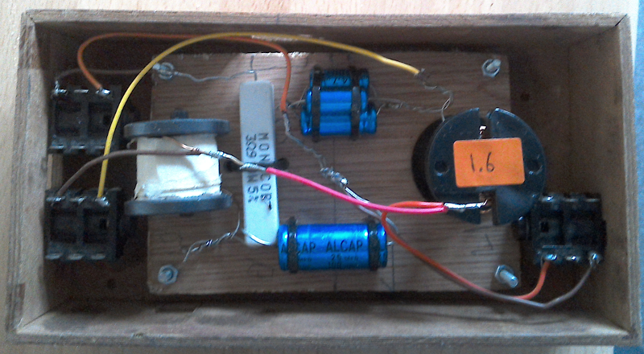
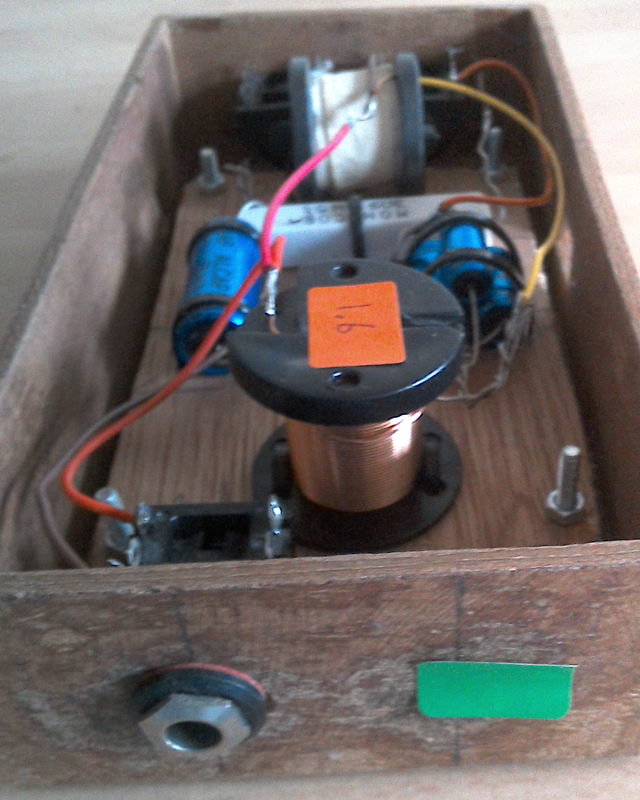
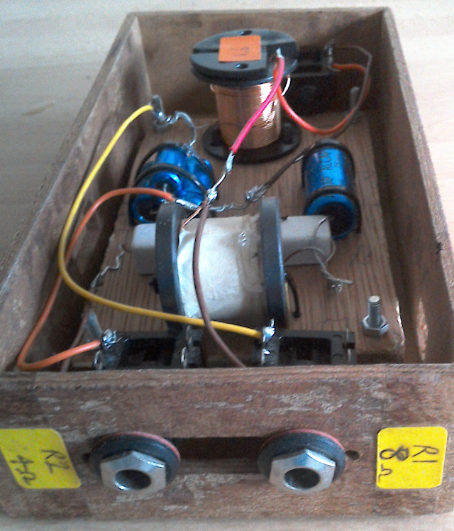

# Mini Crossover

Whereas an original Leslie 122 drives two 16-ohm speakers, this mini crossover is
designed to drive two 8-ohm speakers.

This is a accomplished by doubling the original capacitor values (7.8uF, 12.5uF)
and halving the original inductor values (3.2mH, 5.2mH).

## Parts

* small box 17cm x 9cm x 5.5cm
* 6.35mm jack x 3 (1 in, 2 outs)
* 15.6uF capacitor
* 25uF capacitor
* 1.6mH inductor
* 2.6mH inductor

## Circuit diagram

TODO

## Modifications

Since my bass speaker is 4 ohms and not 8 ohms, I took the liberty of adding a
~4 ohm resistor to the bass output (the white square ceramic resistor).

## Pics

