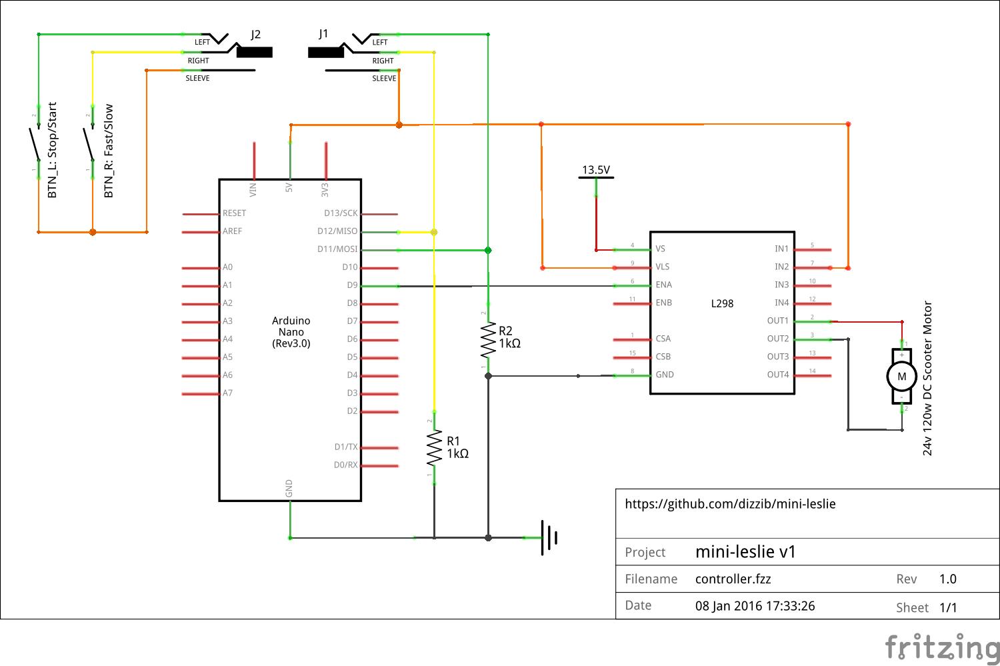

## Introduction

To aim is to reproduce the behaviour of a traditional [Leslie cabinet][Leslie] but in a smaller space.

## Core parts

* Arduino Nano (or similar)
* L298N motor driver board
* 24v/120w scooter motor (not recommended -- see [issue #1](./issues/1))

## Circuit diagram

## Videos

[Arduino + Motor Test](https://www.youtube.com/watch?v=1-SFwXpB4cE)

[Hammond M3 Demo](https://www.youtube.com/watch?v=sb72E83Was0)

[Leslie]: https://en.wikipedia.org/wiki/Leslie_speaker
